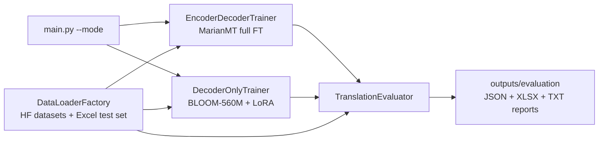

# Domain-Specific Fine-Tuning: Software-Domain EN→NL Translation

A fine-tuning and evaluation pipeline that adapts machine-translation models to the software/technology domain for English→Dutch, and measures the result with standard MT metrics.

It exists to answer a concrete question: how well do two contrasting adaptation strategies — full fine-tuning of a compact encoder-decoder model versus LoRA adapters on a multilingual decoder-only model — perform on software-domain text (UI strings, product specifications) compared with a strong off-the-shelf baseline? The audience is ML engineers working on domain adaptation for translation.

## Architecture at a glance

- **Orchestration pattern:** sequential batch pipeline, dispatched by CLI mode. `main.py` runs up to three phases in order: (1) full fine-tune of MarianMT, (2) LoRA fine-tune of BLOOM-560M, (3) evaluation of baseline and fine-tuned models on two test sets. Nothing runs in parallel or asynchronously; each phase consumes the previous phase's output in-process.
- **Models:** `Helsinki-NLP/opus-mt-en-nl` (MarianMT, encoder-decoder, full fine-tune) and `bigscience/bloom-560m` (decoder-only, LoRA via PEFT). Training loops are built on PyTorch Lightning.
- **State:** no service or session state. State is filesystem artifacts — Lightning checkpoints, saved models/adapters under `outputs/`, TensorBoard logs, and JSON/XLSX evaluation reports. Configuration is a tree of Python dataclasses in `config.py`; runs are seeded (`seed=42`, `deterministic=True`).
- **Retrieval:** none. Data comes from Hugging Face datasets (with a fallback chain) and a local Excel test set.



## Quickstart

```bash
git clone https://github.com/git-bonda108/domain-specific-llm-finetuning.git
cd domain-specific-llm-finetuning
pip install -r requirements.txt

# Baseline evaluation only (no training; downloads the MarianMT model on first run)
python run_evaluation.py
```

`run_evaluation.py` loads the 84-sentence software-domain test set from `data/software_domain_test_set.xlsx`, translates it with the untuned baseline, and prints progress followed by a metrics block:

```
======================================================================
EVALUATION RESULTS - SOFTWARE DOMAIN TEST SET
======================================================================

Model: Helsinki-NLP/opus-mt-en-nl
Test Samples: 84

Metrics:
  BLEU:         24.45
  ...
  chrF:         76.35
  TER:          34.32
```

Results are written to `outputs/evaluation/baseline_metrics.json` and `outputs/evaluation/baseline_translations.xlsx`.

Training runs:

```bash
python main.py --mode all        # both trainings + evaluation
python main.py --mode encoder    # MarianMT full fine-tune + evaluation
python main.py --mode decoder    # BLOOM LoRA fine-tune + evaluation
python main.py --mode baseline   # baseline evaluation only
python main.py --mode evaluate   # evaluation entry point (see note below)
```

Note: `--mode evaluate` accepts `--encoder-model-path`/`--decoder-model-path`, but the loading of pre-trained checkpoints behind those flags is not implemented (`main.py` contains placeholder branches), so that mode currently evaluates the baseline only. Use `--mode encoder`/`--mode decoder` to train and evaluate in one run.

## Configuration

All configuration lives in dataclasses in `config.py` (`DataConfig`, `EncoderDecoderConfig`, `DecoderOnlyConfig`, `EvaluationConfig`, `TrainingConfig`) — edit that file to change models, hyperparameters, LoRA settings, or metric toggles. The pipeline reads no environment variables of its own. Two optional integrations use their libraries' standard credentials:

| Variable | Required | Purpose | Where to get it |
|----------|----------|---------|-----------------|
| `WANDB_API_KEY` | Only if `TrainingConfig.use_wandb = True` (default `False`) | Weights & Biases run logging via Lightning's `WandbLogger` | wandb.ai account settings |
| `HF_TOKEN` | No — all referenced models/datasets are public | Hugging Face Hub authentication, if you swap in gated models | huggingface.co settings |

Hardware selection is automatic (`CUDA` → `MPS` → `CPU`), overridable with `--device`.

## Results

Baseline (untuned `Helsinki-NLP/opus-mt-en-nl`) on the software-domain test set, as recorded in `outputs/evaluation/baseline_metrics.json`:

| Metric | Score |
|--------|-------|
| BLEU | 24.45 |
| chrF | 76.35 |
| TER | 34.32 |

Fine-tuned results are produced by the training modes and are not checked into the repository. See [docs/EVALUATION.md](docs/EVALUATION.md) for the full metrics pipeline and its limitations.

## Repository map

```
config.py                    # All hyperparameters (dataclasses)
data_loader.py               # Training data (HF datasets + fallbacks), test sets, Dataset/DataLoader
encoder_decoder_trainer.py   # MarianMT full fine-tune (PyTorch Lightning)
decoder_only_trainer.py      # BLOOM-560M LoRA fine-tune (PEFT + Lightning)
evaluation.py                # BLEU / chrF / TER / COMET evaluator and model comparison
main.py                      # CLI entry point, phase orchestration
run_evaluation.py            # Standalone baseline evaluation script
notebooks/01_domain_finetuning_demo.ipynb   # Interactive walkthrough of the same pipeline
data/software_domain_test_set.xlsx               # Software-domain test set (84 EN-NL pairs)
outputs/evaluation/                         # Committed baseline metrics + translations
```

## Further documentation

- [docs/ARCHITECTURE.md](docs/ARCHITECTURE.md) — component map, data flow, orchestration and design trade-offs
- [docs/EVALUATION.md](docs/EVALUATION.md) — what is tested today, edge cases handled in code, and a proposed evaluation harness
- [docs/HARDENING.md](docs/HARDENING.md) — current security/operational posture and a staged path to production

`RESULTS_SUMMARY.md` is the benchmark report for this pipeline.

## Author

Satya Bonda
